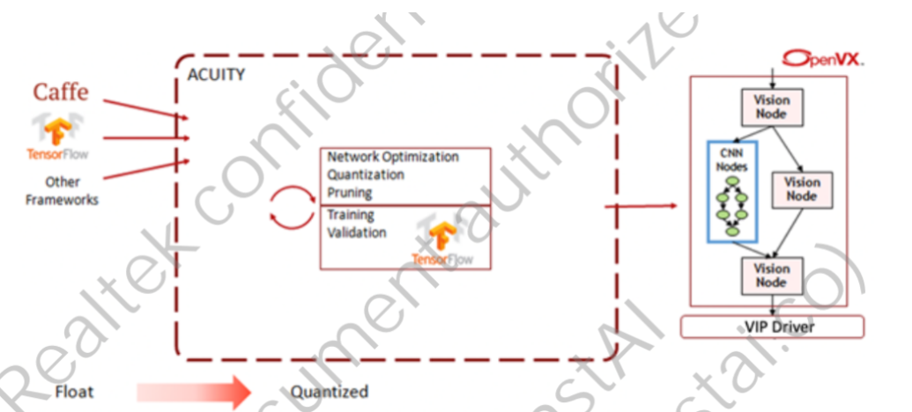

# <div align="center">How To Transfer Model</div>

Before running the inference feature, you need to have a model ready. We use YOLOv3-tiny architecture for implementing the custom model. The first step is to provide the trained custom model as input, and then transfer the model to a specific format that makes it capable to run on the Realtek 3916n.

The image below describes the model transfer procedure. We will use "acuity tool" to convert your model here.



## <div align="center">How to Start</div>

We provide the Container to let user easily sampling pictures, converting model and cross-compiling to generate an executable for RTS3916n. You can download [here](https://drive.google.com/file/d/1NfLpzos6K0CqWbVXyVpKC9tl2tViwrFs/view?usp=sharing). Move the downloaded tar file to directory `~/Realtek`. MD5 checksum should be `899834e2b723383e6b7635cd48b77259`.

<details open>
<summary>Verify zip file with Checksum</summary>

```shell
cd ~/Realtek
md5sum Transfer_Model.tar
```

<details open>
<summary>Extract tar File</summary>

```shell
tar -xvf Transfer_Model.tar
```

<details open>
<summary>Load/Run Container</summary>

```shell
# Load Image
docker load -i image.tar

# Run Container
docker run -it --rm -v $(pwd):/workspace/ --workdir /workspace instai/transfer_model:v4
```

Before starting, let's briefly explain the features of Docker. As you can see, there are three main functions:

`collect.sh`: Sampling images with the camera for AI model dataset.

`convert.sh`: Convert the trained YOLOv3-tiny AI model to RTS3916n compatible format.

`compile.sh`: Cross compile the project and generate the AI model executable can be run on RTS3916n.


<!-- Description -->

This flowchart outlines the process of generating an AI model executable file for RTS3916n: data samples are collected using `collect.sh`, label the objects from captured samples, and train a model, converted it via `convert.sh`, the converted source code would be placed in the project folder, and compiled into an executable using `compile.sh`, user can perform AI model inference and verification with the executable.

</details>

<details open>
<summary>Sampling</summary>

```shell
sh /collect.sh
```

After executing the command, you will get the collect folder. Inside this folder, you will find the executable files. Just execute the command below to save the sampled image from the camera:

```shell
# Remember to execute the files on the board, not in the Docker container
cd collect
./yolov3tiny network_binary.nb
```

</details>

<details open>
<summary>Convert</summary>

```shell
sh /convert.sh <model-name>.cfg <model-name>.weights
```

After executing the script, it will generate the result folder named `transfer_model` in your current directory. This folder contains the model structure and other important information, don't modify the content in it.

</details>

<details open>
<summary>Compile</summary>

```shell
sh /compile.sh transfer_model/
```

After executing the script, it will show two options below:

```shell
1.Inference
2.Verification
select mode:
```

`Inference`

- Capture camera frame, perform inference, and save the result as a bitmap in real-time.

`Verification`

- Receive a JPG input file, perform inference, and save the result as a bitmap and TXT file containing information of position, object type and confidence level of each bounding boxes.

Hint: In the Inference mode, there are two types that can be selected after you choose the mode.

After selecting the mode, you need to enter the correct number of classes of provided YOLOv3-tiny model. Otherwise, it will fail when you deploy it on the board.

```shell
# Input 
Classes Num:
```

After Cross Compile, you will get the `build` folder inside the `transfer_model`:

```shell
# Two necessary files
ls transfer_model/build
network_binary.nb  yolov3tiny
```

</details>

Congratulations! You have completed this tutorial. You can refer to other documents below:

- [How To Excute the Inference](../doc/inference.md)
<!-- - [How To Display Frame In The Real-Time (via UDP)](../doc/udp.md) -->